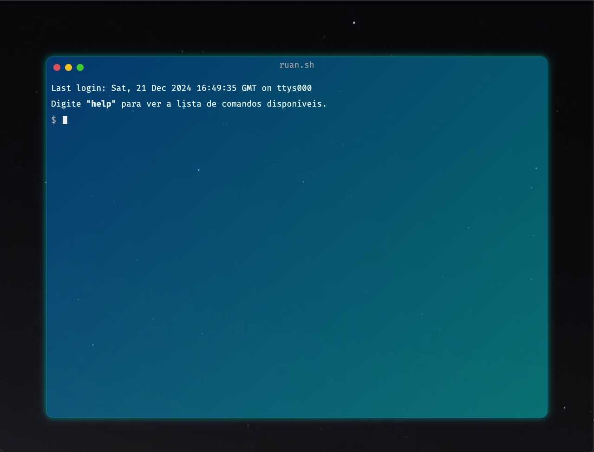
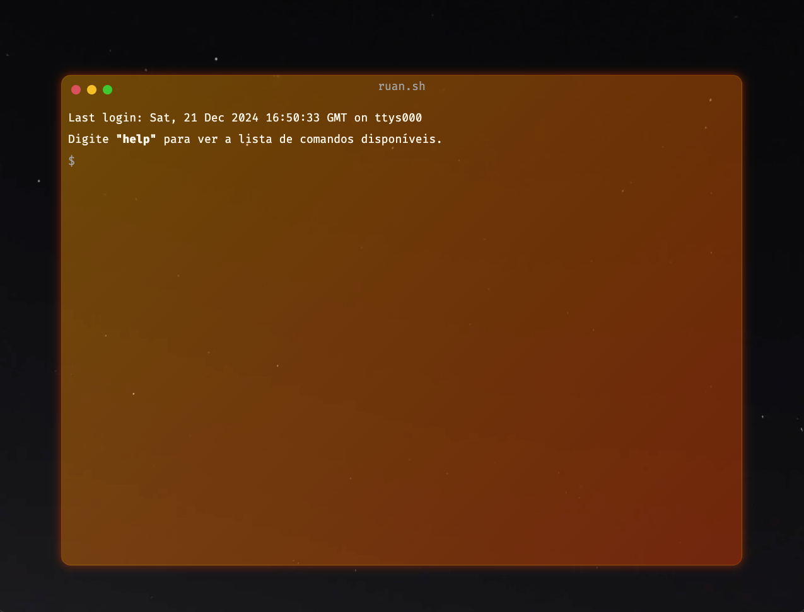
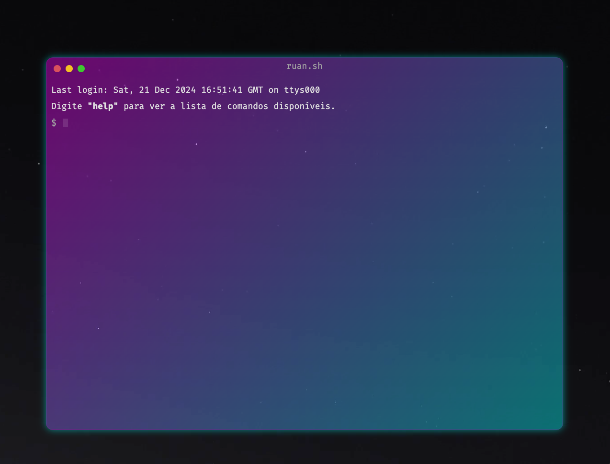
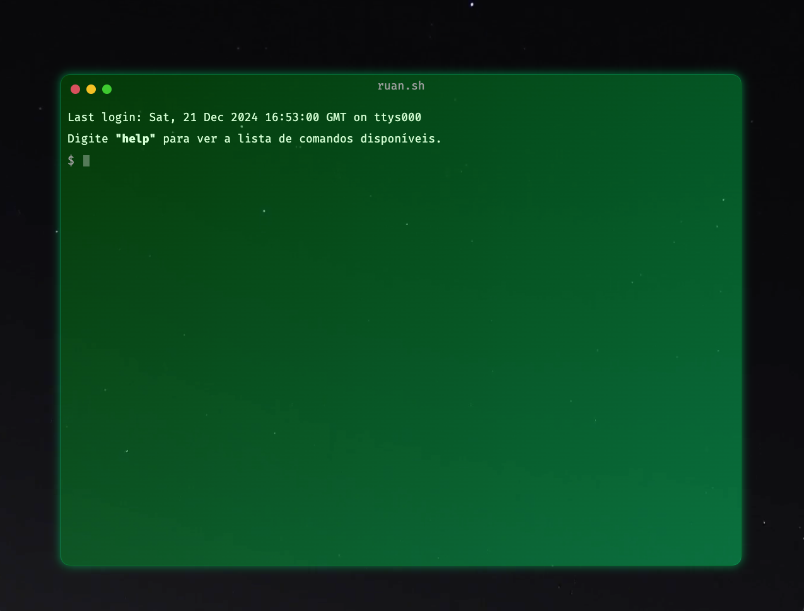
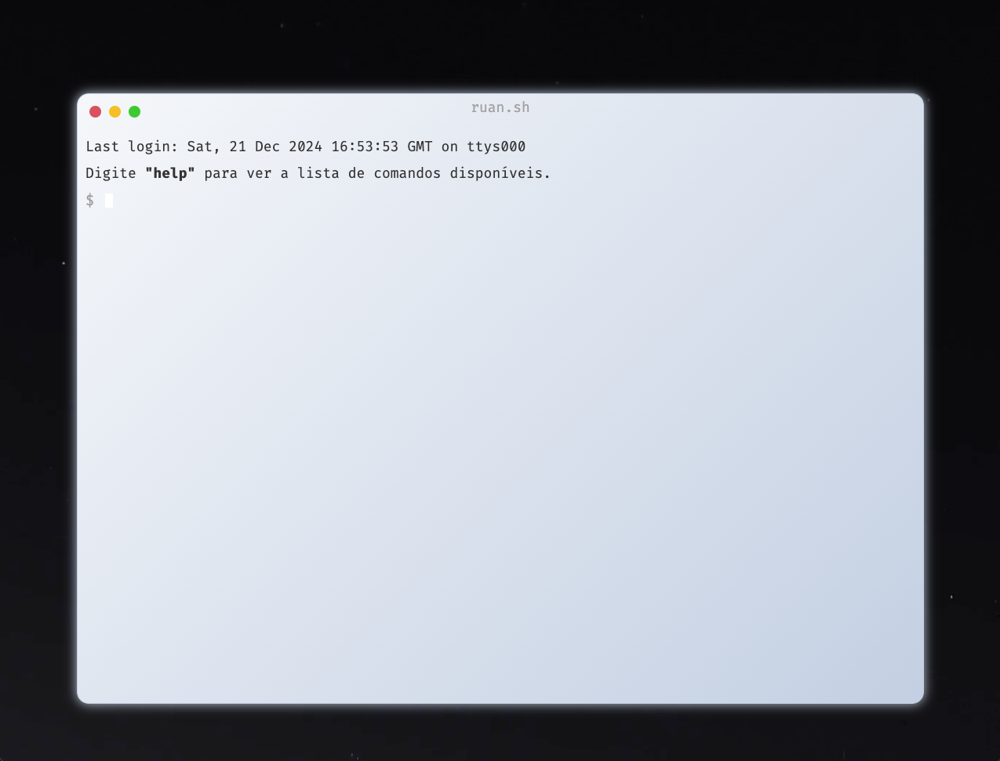
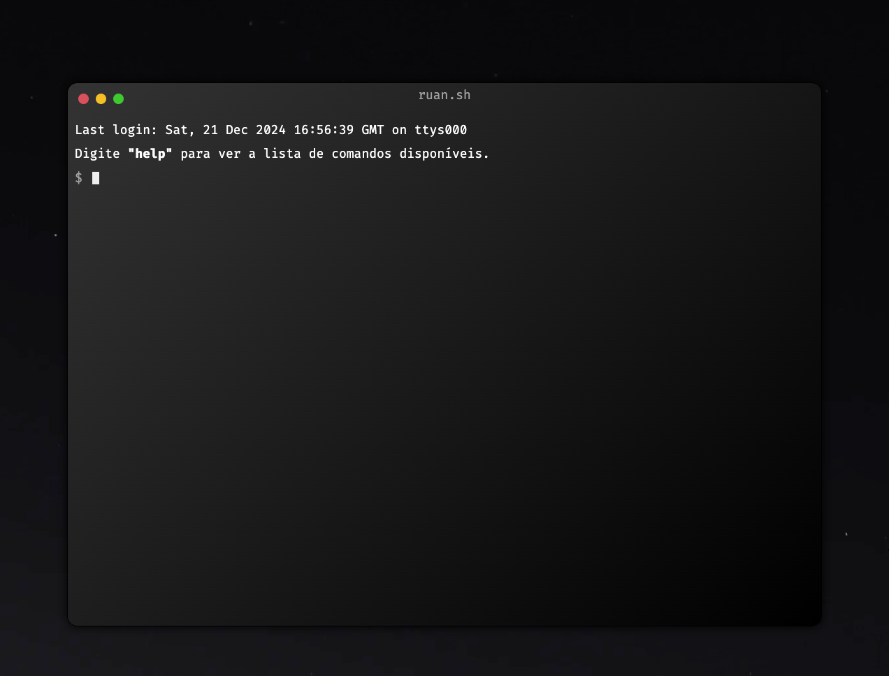
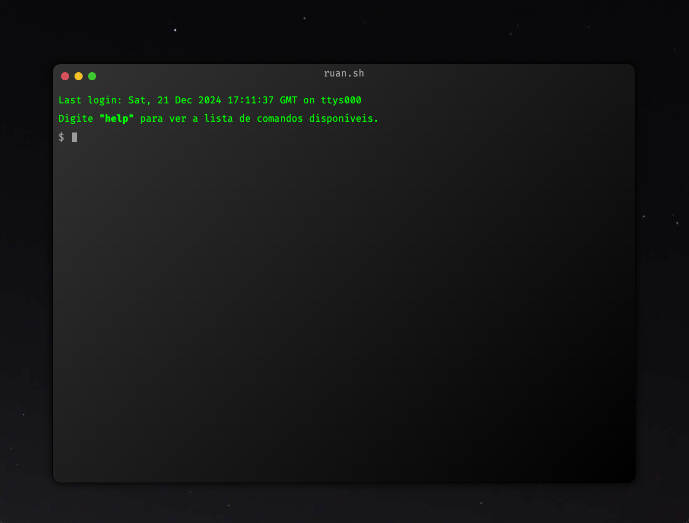
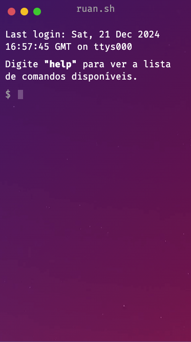

# ruan.sh - A Terminal Emulator-Style Portfolio

Portfolio website designed with a sleek terminal-inspired interface.

## Screenshoots










### Mobile



## Technologies

- React.js with Vite
- TypeScript
- Styled Components
- React Terminal UI

## Usage

Type **help** to see all available commands.

## Development

Run:

```
yarn install
yarn dev
```

To build for production:

```
yarn build
```
